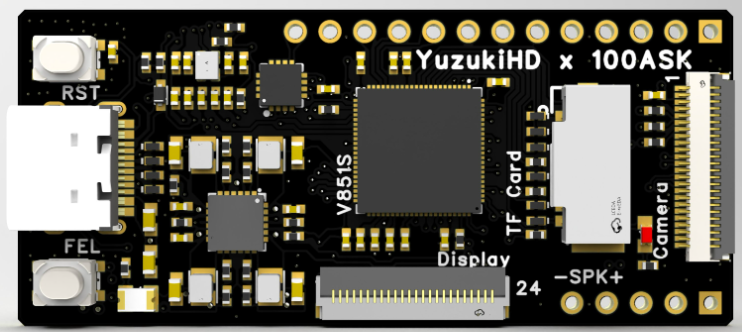

# meta-yuzukilizard-v851s

## Instruction how to build an image for Yuzuki  in Yocto

### Products:

  
 

## General Note:
Assumed that Linux Ubuntu is installed

## List of tested elements

System start correctly on ttyS0  
The USB ETH works correctly, can login on ssh 192.168.10.1 -l root  
The LED cpu trigger works correctly  
Resize of mmcblk0p2 working correctly  

## List of not tested elements

Lcd  
Touchscreen  
Backlight for Lcd  
Risc uC  
Audio  
Wifi  
SPI Flash, no system image prepared for it  
Bluetooth  

## How to build an images

1. First make sure to following packages are installed in system

    ***sudo apt install gawk wget git diffstat unzip texinfo gcc build-essential chrpath socat cpio python3 python3-pip python3-pexpect xz-utils debianutils iputils-ping python3-git python3-jinja2 python3-subunit zstd file locales libacl1***
    
    on Ubuntu 24.04 also issue
    ***sudo locale-gen "en_US.UTF-8"***

    **Note:**
    More informations can be found on Yocto reference manual.

2. Download necessary Yocto packaged listed below. Be sure to be in root of home folder.

	***mkdir yocto*** 
	***cd yocto***  
	***mkdir build***  
	***git clone git://git.yoctoproject.org/poky --depth 1 -b kirkstone***  
  ***cd poky***  
  ***git clone git://git.yoctoproject.org/meta-arm -b kirkstone***  
	***git clone git://git.openembedded.org/meta-openembedded --depth 1 -b kirkstone***  
	***git clone https://github.com/meta-qt5/meta-qt5.git --depth 1 -b kirkstone***  
	***git clone https://github.com/voloviq/meta-yuzukilizard-v851s.git -b kirkstone***  

3. Select directory to build Linux

	***source oe-init-build-env ~/yocto/build/yuzukilizard-v851s***  

4. Modify bblayers.conf(located in ~/yocto/build/yuzukilizard-v851s/conf)

    *BBLAYERS ?= " \\\
      ${HOME}/yocto/poky/meta \\\
      ${HOME}/yocto/poky/meta-poky \\\
      ${HOME}/yocto/poky/meta-openembedded/meta-oe \\\
      ${HOME}/yocto/poky/meta-openembedded/meta-networking \\\
      ${HOME}/yocto/poky/meta-openembedded/meta-python \\\
      ${HOME}/yocto/poky/meta-openembedded/meta-multimedia \\\
      ${HOME}/yocto/poky/meta-arm/meta-arm-toolchain \\ \
      ${HOME}/yocto/poky/meta-qt5 \\\
      ${HOME}/yocto/poky/meta-yuzukilizard-v851s \\\
      "* 

    **Note:** Please adapt PATH of conf/bblayers.conf if necessary.  

5. Modify local.conf(located in ~/yocto/build/yuzukilizard-v851s/conf) file

    - modify line with "MACHINE ??" to add "yuzukilizard-v851s"

    - align *DL_DIR = "${HOME}/yocto/downloads"*  

    - align *SSTATE_DIR = "${HOME}/yocto/sstate-cache"*  
    
    - align *TMPDIR = "${HOME}/yocto/tmp"*  
    
    - add at the end following records    
  *RM_OLD_IMAGE = "1"*  
	*INHERIT += "rm_work"*  

  **Note:** Please adapt rest of conf/local.conf parameters if necessary.  

6. Build objects

    - console image  
      ***bitbake console-image***  

    - qt5 image  
      ***bitbake qt5-image***  

    - qt5 toolchain sdk  
      ***bitbake meta-toolchain-qt5***  

7. After compilation images appears in

	*~/yocto/tmp/deploy/images/yuzukilizard-v851s/qt5-image-...*  

8. Insert SD CARD into dedicated CARD slot and issue following command to write an image

    **Note:**  
    Be 100% sure to provide a valid device name (of=/dev/**sdd**). Wrong name "/dev/sdd" damage Your system file !    
    ***sudo dd oflag=nocache if=~/yocto/tmp/deploy/images/yuzukilizard-v851s/qt5-image-yuzukilizard-v851s.wic of=/dev/sdd bs=1024***  

9. When it is necessary to modify and test new AWBoot application the raw image can be write using

    ***scp awboot-boot-sd.bin root@192.168.10.1:/home/root***  

    ***dd if=/home/root/awboot-boot-sd.bin of=/dev/sdd bs=1024 seek=8***  

**Note:**  
  Awboot taken from git@github.com:szemzoa/awboot.git. Many thanks to the Author for help.  
